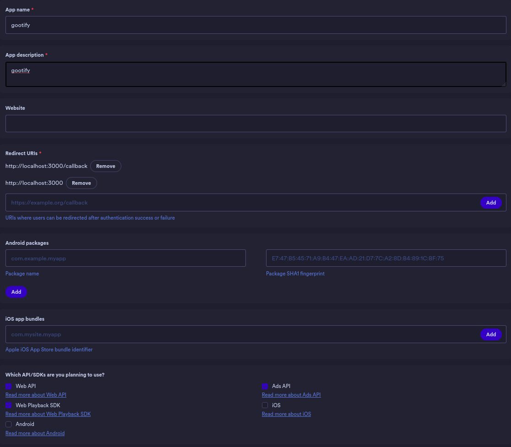

# Requirements
- firefox

# Set up
- run the following:
```
firefox -CreateProfile gootify
```
```
firefox -P gootify
```
- open settings within firefox and enable DRM and autoplay

## .env File
- gootify requires a few environment variables in a .env file in the root dir of the application. 
- here's an example below:
```
CLIENT_ID=<client ID>
CLIENT_SECRET=<client secret>
SERVER_ADDRESS=localhost
SERVER_PORT=3000
TOKEN_STORE_PATH=/home/<user>/.config/wrappinator/token/
TOKEN_FILENAME=token.json
```

## Spotify ID & Secret
- go [here](https://developer.spotify.com/dashboard)
- create a new application and fill in the following:
	+ app name: can't be left blank, fill it with whatever you want
	+ app description: same as the app name
	+ website: can be left blank
	+ redirect url: 
	```
	http://<SERVER ADDRESS\>:<SERVER PORT\>
	```
	+ enable the following apis:
		* web api
		* web playback SDK
		* Ads API
- it should look like this:
	+ 

## Start up
- start gootify with the binary, the first start up will print a link in terminal, this link is to authorize the user account and acquire an oauth2 token to use. This only has to be done once, unless the token is deleted from the store path.
- gootify may have to be restarted after this.
- the directory mentioned as the store path will be created if it hasn't already
